> # TC Go Co.
The all-new To Go Co. Till System—designed to revolutionize the way you manage and sell currency! 

The To Go Co. Till System allows you to efficiently manage currency stock, process customer purchases, perform real-time currency conversions, and generate detailed transaction receipts, all through a simple, intuitive interface.

Designed for the small screen first and With its sleek, user-friendly interface, the system ensures seamless transactions, real-time stock updates, and accurate currency conversions, making every customer interaction quick, efficient and able to be used anywhere from phones to tablets and desktop pc's. Plus, our brand-new digital receipt feature lets you print detailed transaction summaries at the touch of a button. Whether you're selling USD, GBP, or JPY, the To Go Co. Till System is your ultimate tool for providing a superior customer experience while keeping operations running smoothly. Upgrade your business today!

> ## Project goal
The goal of this project is to develop a Currency Stock and Till System for To Go Co., a travel cash shop. The system aims to streamline the management of currency inventory, enabling the staff to easily track stock levels and prices. It also allows customers to purchase foreign currency, with real-time exchange rate calculations, and provides a receipt for every transaction. The project aims to create an efficient, user-friendly interface for both admins and customers, simplifying the process of currency management, purchase transactions, and record-keeping. Ultimately, the system will enhance customer experience, improve operational efficiency, and ensure accurate financial transactions.

> ## Target Audience
The target audience for the Currency Stock and Till System would be:

- Travel Agencies and Currency Exchange Providers – Businesses that deal with foreign exchange, offering various currencies to travellers. They would benefit from a   streamlined system that manages stock and exchange rates efficiently while providing a smooth transaction process for customers.

- Tourism-related Businesses – These include travel agents, tour operators, and even airport currency exchange kiosks. They require a reliable system to offer currency to 
  customers in a simple, automated manner, especially in busy environments where speed and accuracy are critical.

 - Retail and Hospitality Industry – Hotels, resorts, and retail shops located in tourist-heavy areas, where guests may require currency exchange services.

-  Travel Enthusiasts – Individual travellers or groups who may be purchasing or exchanging foreign currencies for their trips would also be an indirect audience for this type  
   of system, as it provides them with an efficient way to complete currency transactions.

-  Small Business Owners – Owners of small currency exchange or travel service businesses who want a low-cost but efficient way of tracking currency stock and processing 
   transactions.

By targeting these groups, the system can address common challenges faced by businesses that provide currency exchange, while also improving customer service and operational efficiency.

> ## Design
My first job was to design my travel currency program to get the right look, layout, and menu structure. I used the mobile first method in developing it for small screens, so it can be used on any device. 

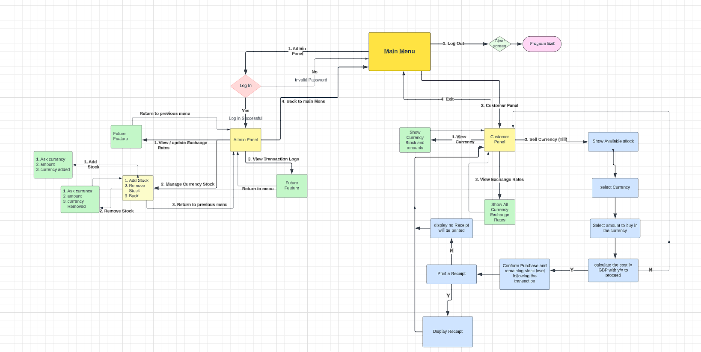

> ## Features
The TC Go Co. Travel Currency Till System is a comprehensive and user-friendly solution designed to manage travel currency operations efficiently. Below are its key features:

User-Friendly Design
Features an easy-to-navigate menu system.
Custom-designed to suit the needs of travel cash shops, ensuring a smooth workflow.
Clean input prompts with organized outputs for professional usability.
System Efficiency
Real-time updates on stock levels and transactions.
Modular design ensures future enhancements can be integrated seamlessly.

>> ### **Main Menu.**

The Main Menu is the backbone of the program, giving options to branch out 
quickly and easily accessing different system areas.

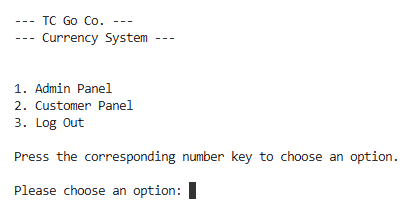

>> ### **Admin area and Login**
Simple password-protected access ensures only authorized personnel can modify data.
Admin Panel: Enables staff to view, add, or remove currency stock levels.
Provides real-time updates on currency quantities to ensure accurate stock monitoring.

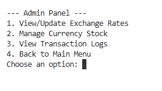
 
>> ### **Admin option 1**
View/Update Exchange Rates, is an upcoming feature.

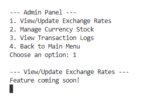

>> ### **Admin option2**
Manage Currency Stock, allows the user to add or remove stock without the need to make a sale.

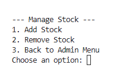
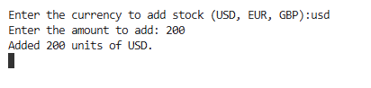

>> ### **Admin option 3**
View Transaction Logs is an upcoming feature that will allow the use of currency tracking and auditing.

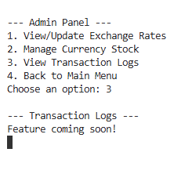

> ### **Customer Menu**
 Intuitive interface for customers to explore stock availability and exchange 
 rates. it also has the Till option to sell currency with the option print receipts if required.

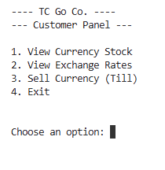

> ### **Customer panel option 1**
 View Currency Stock, allows the user to quickly access stock records to offer information to the customer quicker and with ease.

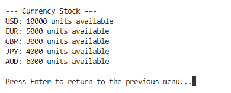

> ### **Customer panel option 2**
Currency Exchange Rates displays up-to-date exchange rates for multiple currencies.
- Accessible to both admin’s and customers for transparency.
  Allows customers to calculate costs quickly and confidently.

- Displays up-to-date exchange rates for multiple currencies.
  Accessible to both admins and customers for transparency.
  Allows customers to calculate costs quickly and confidently.

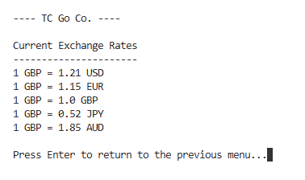

>> ### **Customer panel option 3**
**Sales Till System**  
Customers can purchase their desired currency in real-time.
Automatically calculates the cost based on current exchange rates.
Ensures transactions are seamless and accurate.

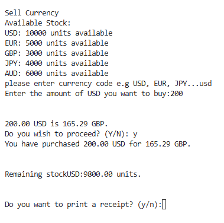

**Printable Receipt**

After a transaction, customers have the option to print a detailed receipt.
Includes transaction details such as the purchased amount, currency, and total cost.
Enhances the professionalism of the service.

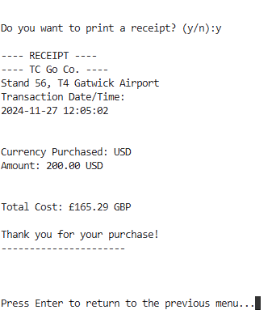

> ## Manual testing

Testing the functionality of the program and identify any runtime errors or logical flaws.

This report outlines the error testing process conducted for the Currency Stock System. The primary goal was to ensure the program adheres to best practices, is free from syntax errors, and functions as intended. Testing was performed using the following methods:

- Continuous Integration (CI) Linter with PEP8 Compliance.
- Manual Testing of Functionality.
- Screenshots Demonstrating Error-Free Execution.
- Screenshots Showing simulated errors and error validation.

## Code Submission: The code was submitted to the CI tool for automated style checking.

**Review and Corrections:**
- Long lines exceeding 79 characters were identified and broken into multiple 
  lines using parentheses.
- Indentation errors and spacing issues were corrected.
- Blank lines removed

**Final Check: After making corrections, the code was re-submitted to ensure it passed all checks.**

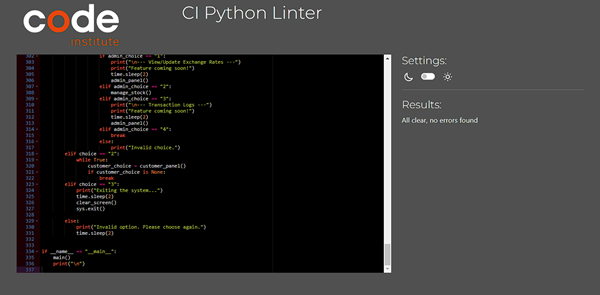

## Development Testing

During the initial program development and testing phases, it was observed that error's were coming up as I went along here are the main issues found:

***Use of the Clear Screen Function***

- During initial testing, I observed that the terminal output resembled a continuous log, quickly becoming cluttered and overwhelming.

- To enhance readability and improve the user experience, I implemented a clear screen function. This function is utilized in menu navigation and certain program features to 
  keep the display clean and organized.

***Incorporating time.sleep(2) and Input Pauses***

Reason for Adding time.sleep(2)

- messages and prompts often disappeared too quickly, especially when the program transitioned back to the previous menu. This made it difficult for users to read and  
  understand the messages before the screen was cleared or the next menu appeared.

- To address this issue, I added time.sleep(2) pauses after certain error messages and user prompts. This function temporarily halts the execution of the program for 2 seconds, 
  giving users sufficient time to read the displayed messages.

Implementation of time.sleep(2)
The time.sleep function was imported from Python’s built-in **time** library at the beginning of the program.

***Adding "Press Enter to Continue" Prompts***

- In addition to time.sleep(2), I added "Press Enter to continue" prompts in sections where users might require more time, such as after viewing stock or exchange rates.
  This  ensures that users can take as much time as they need before moving on.

Example:
input("\nPress Enter to return to the previous menu...\n")

***Functions Revert Back to the Main Menu***

- When using set functions further inside the program, when either an invalid input or the program had completed its task it would revert back to the main menu.

- To fix this I updated the code to revert back to the previous menu or try again depending of the task at hand.

## Systematic Testing

The following tests were carried out to ensure the program operated as intended, ironing out errors at every stage.

**Invalid menu option in the main menu**

**Invalid currency input**

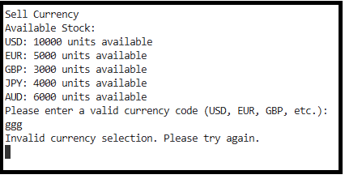

**Non-numeric input for currency amount**

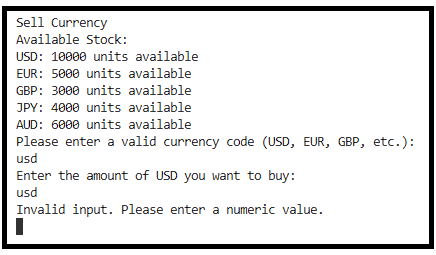

**Purchasing more currency than available**

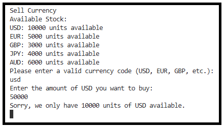

**Correct transaction flow**

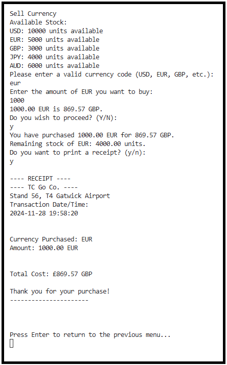

**Admin panel password verification**

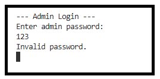

**Exit options in customer and admin panels**

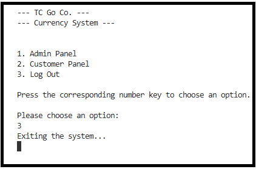

 **Following the previous exit option, returns the Terminal back to a clean blank state, ready for the next command.**

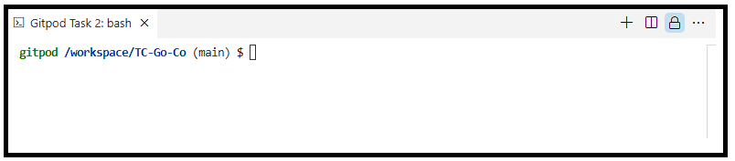

> ## Deployment

**How I Deployed This Project**

This project was developed using GitPod as the Integrated Development Environment (IDE) and GitHub as the version control repository. It was deployed to Heroku to make it publicly accessible.

**Deployment Process**

1. ***Version Control with GitHub***

- https://github.com/Rick-8/TC-Go-Co
- Created a GitHub repository to store the project code.
- Used git commands (git add, git commit, git push) to track changes and push the code to the remote 
  repository on GitHub.

2. ***Development in GitPod***

- Opened the repository in GitPod, an online IDE, for writing, debugging, and testing the code.
- Installed necessary dependencies and created the application logic in Python.

3. ***Preparing for Deployment to Heroku***

- Created a requirements.txt file using pip freeze > requirements.txt to list all the necessary dependencies 
  for the project.
- Committed and pushed these files to GitHub.

4. ***Deploying to Heroku***

- Logged in to Heroku and created a new application named to-go-co.
- Linked the Heroku app to the GitHub repository by selecting the "Deploy" tab in the Heroku dashboard.
- Enabled "Automatic Deploys" to ensure that every push to the GitHub main branch automatically triggers a 
  redeployment.
- Manually deployed the application for the first time to ensure everything was set up correctly.
  
5. ***Accessing the Application***

- The application is live and can be accessed at the following link:
- https://to-go-co-aac5a94da9b3.herokuapp.com/

> ## Credits

I am grateful for the support and guidance of my mentor throughout this project.

Additional credits:

- Project Inspiration: Derived from the Love Sandwiches project, which guided me in Heroku deployment.
- Flow Chart Design: Created using Lucid.app.
- Logo: Designed with the help of ChatGPT.
- Development Tools: GitHub and GitPod for repositories and IDE.

